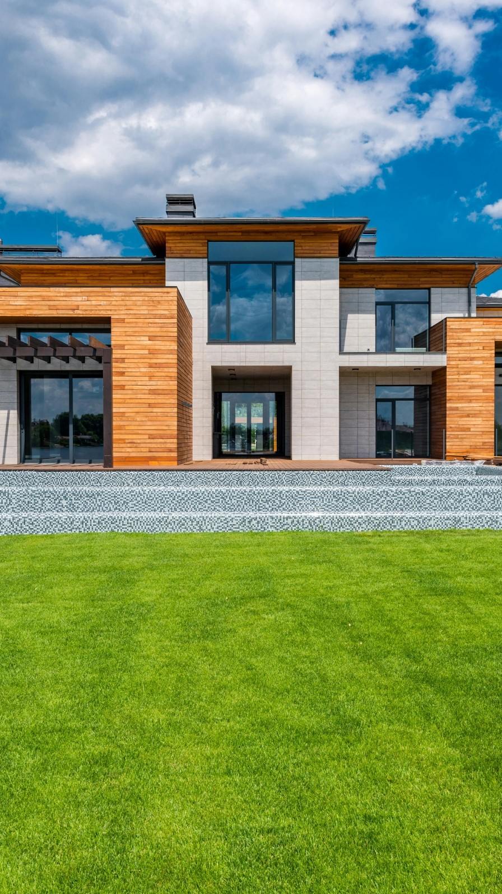
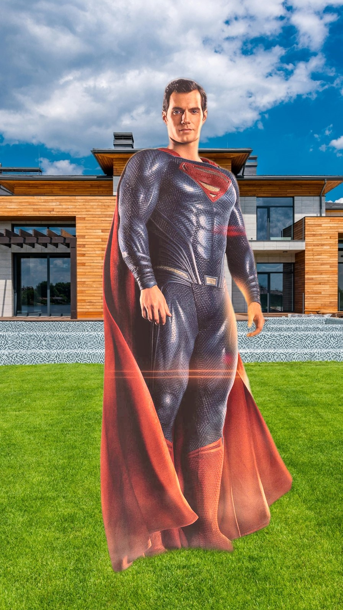
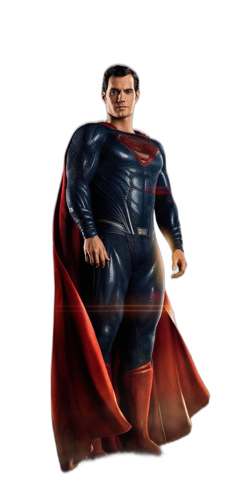
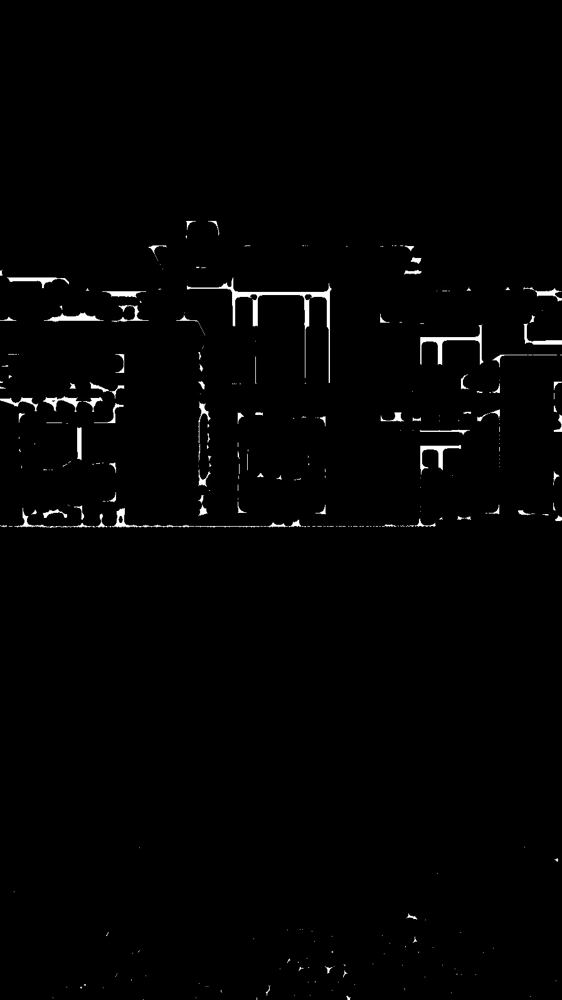
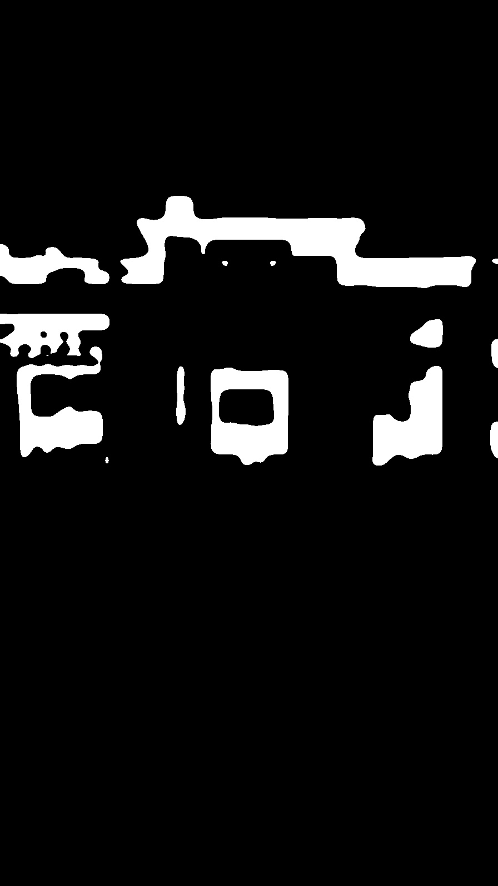
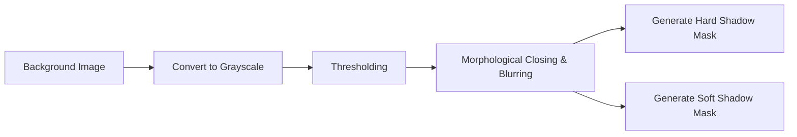

# Flam AI Assignment: Seamlessly Integrating a Person into a Scene

## Objective
The objective of this assignment is to implement a step-by-step process to place a person into a given scene and seamlessly blend them to make the result look photorealistic.

## Table of Contents
- [Example Output](#example-output)
- [Structure](#structure)
- [Pipeline Overview](#pipeline-overview)
- [Shadow Mask Refinement](#shadow-mask-refinement)
- **[ALGORITHM DOCUMENTATION](#algorithm-documentation)**
  - **[TASK 1: Capturing and Preparing the Person's Image](#task-1-capturing-and-preparing-the-persons-image)**
  - **[TASK 2: Analyzing Shadows and Lighting of the Background Image](#task-2-analyzing-shadows-and-lighting-of-the-background-image)**
  - **[TASK 3: Determining Light Direction](#task-3-determining-light-direction)**
  - **[TASK 4: Coloring and Blending](#task-4-coloring-and-blending)**
  - **[TASK 5: Generating the Final Output](#task-5-generating-the-final-output)**
- [Tools & References](#tools--references)
- [Usage](#usage)
- [Author Information](#author-information)

## Example Output

Below are the input and output images generated by the script:

<table>
  <tr>
    <td align="center"><strong>Input: Person</strong><br></td>
    <td align="center"><strong>Input: Background</strong><br></td>
    <td align="center"><strong>Output: Final Composite</strong><br></td>
  </tr>
  <tr>
    <td align="center"><strong>Output: Extracted Person</strong><br></td>
    <td align="center"><strong>Output: Background Shadow Hard</strong><br></td>
    <td align="center"><strong>Output: Background Shadow Soft</strong><br></td>
  </tr>
</table>

## Structure
- `compose.py`: main script to remove background, match colors, estimate lighting/shadows, and composite.
- `inputs/`: drop `person.jpg` (front view) and `background.jpg` (scene).
- `output/`: generated masks and final composite image.

## Pipeline Overview


## Shadow Mask Refinement



# ALGORITHM DOCUMENTATION

## TASK 1: Capturing and Preparing the Person's Image

1. **Capture a High-Quality Image**
   - Front-view portrait in a well-lit, evenly exposed environment.
   - Use a neutral background or chroma key if available to simplify segmentation.

2. **Remove the Background**
   - Use an automated matting or background-removal tool (e.g., `rembg`).
   - Output: transparent `person.png` with alpha channel.

3. **Preprocessing & Alignment** *(missing step)*
   - **Scale & Orientation**: Resize and orient the extracted person to match the perspective of the new scene.
   - **Edge Feathering**: Apply slight blur to the alpha matte to avoid hard edges when compositing.

## TASK 2: Analyzing Shadows and Lighting of the Background Image

1. **Detect and Classify Shadows**
   - Convert background to grayscale and threshold to isolate dark regions.
   - Morphological closing and blurring to separate **hard** (sharp) vs **soft** (diffuse) shadows.
   - Generate and save binary masks: `shadow_hard.png`, `shadow_soft.png`.

2. **Refine Shadow Masks** *(missing step)*
   - Use adaptive thresholding or color-based segmentation to handle textured backgrounds.
   - Optionally incorporate edge detection to refine shadow boundaries.

## TASK 3: Determining Light Direction

1. **Outdoor Scenes**
   - Compute 2D centroids of the person mask and the soft-shadow mask.
   - Derive a 3D light vector by adding a downward Z component proportional to scene scale.
   - Normalize to unit length: `light_dir`.

2. **Indoor Scenes** *(missing step)*
   - Estimate approximate lighting direction by analyzing image gradients or using deep-learning light-estimation networks.
   - Use detected strong highlights/shadows on scene objects to infer light positions.

## TASK 4: Coloring and Blending

1. **Color Matching**
   - Convert person and background crops to LAB color space.
   - Match only the L-channel histogram to preserve skin chroma.

2. **Gamma & Tone Adjustment**
   - Apply gentle gamma correction (e.g., γ=0.9–0.95) for midtone consistency.
   - Use LUT-based corrections for efficient per-channel mapping.

3. **Contrast & Saturation Enhancement**
   - Apply CLAHE on L-channel for local contrast improvements.
   - Boost saturation in HSV space by a controlled factor (1.05–1.15).

4. **Warmth & Vibrance Tweaks**
   - Slightly increase the red channel and LAB a/b channels for warmth (+3–5 units).
   - Final vibrance boost by increasing mid-level saturation.

5. **Edge Blending** *(missing step)*
   - Feather composite edges using the alpha mask to avoid halos.
   - Use multi-scale Gaussian pyramid blending if high realism is required.

## TASK 5: Generating the Final Output

1. **Composite Placement**
   - Position person at the desired location with offsets matching scene perspective.
   - Overlay synthetic shadow beneath the person based on the computed light direction.

2. **Final Composite Rendering**
   - Blend person and shadow into the background using manual alpha compositing.
   - Save output in matching format (e.g., `final_composite.jpg`).

## Tools & References
- Python, OpenCV, NumPy, scikit-image, rembg.
- Research on image harmonization and color transfer (e.g., Reinhard et al. 2001).
- Shadow detection techniques and deep-learning light-estimation methods.

## Usage
1. Place `person.jpg` and `background.jpg` in the `inputs` folder.
2. Install dependencies:
   ```powershell
   pip install -r requirements.txt
   ```
3. Run the script:
   ```powershell
   python compose.py --no-shadow
   ```
4. Review results in `output/`.

## Author Information

<table>
  <tr>
    <td><strong>Name:</strong></td>
    <td>Nayan Mandal</td>
    <td><strong>Roll No.:</strong></td>
    <td>BT22CSD035</td>
  </tr>
  <tr>
    <td><strong>Program:</strong></td>
    <td colspan="3">B.Tech - Computer Science Engineering (Minor in Data Science and Analytics)</td>
  </tr>
  <tr>
    <td><strong>Institute:</strong></td>
    <td colspan="3">Indian Institute Of Information Technology, Nagpur</td>
  </tr>
  <tr>
    <td><strong>Email (Institute):</strong></td>
    <td><a href="mailto:bt22csd035@iiitn.ac.in">bt22csd035@iiitn.ac.in</a></td>
    <td><strong>Email (Personal):</strong></td>
    <td><a href="mailto:nayan.iiitn@gmail.com">nayan.iiitn@gmail.com</a></td>
  </tr>
  <tr>
    <td><strong>GitHub:</strong></td>
    <td><a href="https://github.com/9keystrokes">github.com/9keystrokes</a></td>
    <td><strong>LinkedIn:</strong></td>
    <td><a href="https://linkedin.com/in/9keystrokes">linkedin.com/in/9keystrokes</a></td>
  </tr>
</table>